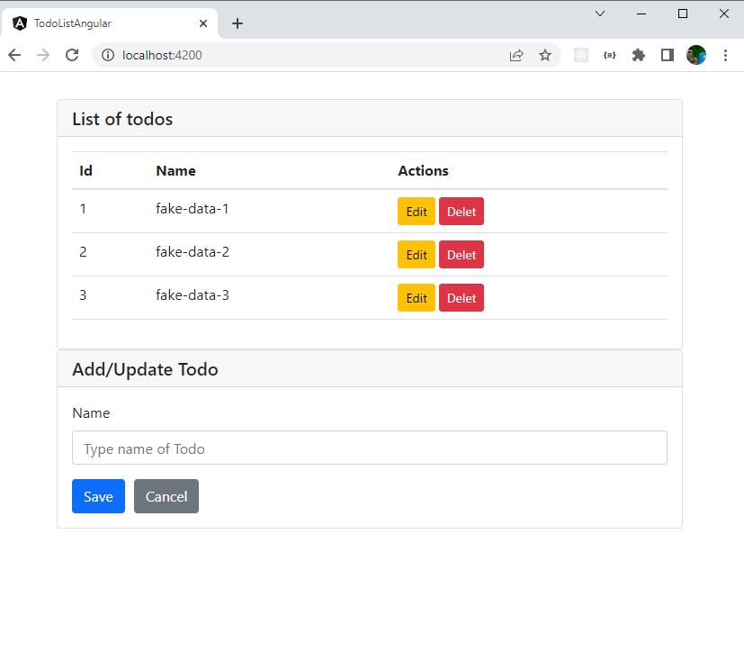

# TODO LIST COM ANGULAR API
<p align="center">
  
  <br/>
</p>

### Instalando o projeto
Caso queira testa-lo em sua máquina, siga os passos abaixo:

**Clone este Repositorio**

```
$ git clone https://github.com/LucasMSCaetano/todo-list-angular-api.git

$ cd todo-list-angular-api
```
**Crie as variáveis de ambiente**
```
crie no diretorio raiz o arquivo .env, segue um exemplo de como criar o arquivo via cmd (windows)

$ copy con .env
$ cd .env

agora sete as variáveis de ambiente conforme as abaixo:
PORT=
DATABASE_HOST=
DATABASE_PORT=
DATABASE_NAME=
DATABASE_USER=
DATABASE_PASS=

```
**Instale as dependências**

```
$ yarn
```

_ou_

```
$ npm install
```

**Agora basta executar o comando**

```
$ yarn dev
```


